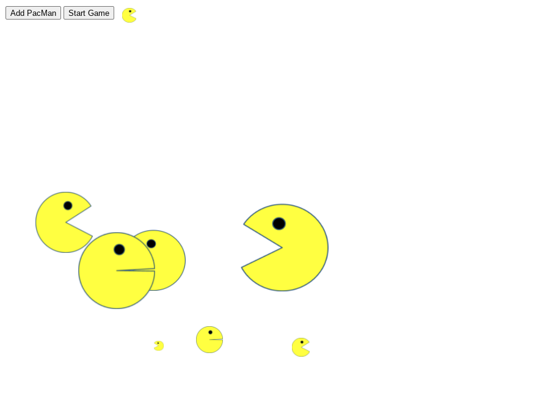

# PacMen

## Description 
PacMen move accross the browserfrom right to left within screen boundary, change direction on either hitting the border of the window and eating "air" as they move.
Originally, this showed how to move one Pacman from left to right and right to left in a straight line, changing direction upon hitting a border of the window. Next, it allowed the ability to add more than one Pacman and to have them move not just in a horizontal plane but a vertical plance as well.

## Purpose 
This was done as an assignment in the MIT course - Full Stack Development with Mern

---------

## Technologies Used 
- HTML
- CSS
- Javascript

---------

## Installation 
- Clone this repository to your local machine

## How to Run 
- Browse to the directory where you cloned this repository
- Open the .html file in a browser (Chrome, Edge, Safari, Firefox)
- When the browser is loaded, click on the 'Add PacMan' button *the more you click, the more Pacmen are created
- Click on the 'Start Game' button to have thhe Pacmen begin moving *You can add more Pacmen at any time by simply clicking on the 'Add Pacman' button

---------

## Improvements Made
- 2022-02-04: Randomized the size of the Pacman when created
- 2022-02-04: Upon hitting the left or right border of the window, change direction that PacMan is facing *each Pacman is controlled seperately
- 2022-02-04: Have Pacman eat "air" as it moves *while in the first version, it was not in the second version
- 2022-02-04: Changed z position of the buttons to ensure they are always on top *since start position of Pacmen are random, they could be on top of the buttons, and hence block user access
- 2022-02-04: Moved style to css and javascript to js files

## Roadmap of Future Improvements
- Add ghosts
- Add the ability to delete a ghost upon clicking on the ghost

---------

## Files 
- **/images/PacMen.png** - Used in the Readme file 
- **/images/PacMan1.png** - Facing left with mouth open 
- **/images/PacMan2.png** - Facing left with mouth closed 
- **/images/PacMan3.png** - Facing right with mouth open 
- **/images/PacMan4.png** - Facing right with mouth closed 
- **index.html** - Start-up File to be opened by browser 
- **styles.css** - Stylesheet file that positions objects, controls text, colors, and layout
- **pacman.js** - Javascript file manipulating what is occuring in the browser 

---------

## Contributing 
Pull requests are welcome. For major changes, please open an issue first to discuss what you would like to change.

## License
[The MIT License (MIT)](https://github.com/slumpbuster/PacMen-Excercise/blob/main/LICENSE)

---------

## Return to [Slumpbuster Portfolio](https://slumpbuster.github.io/)
